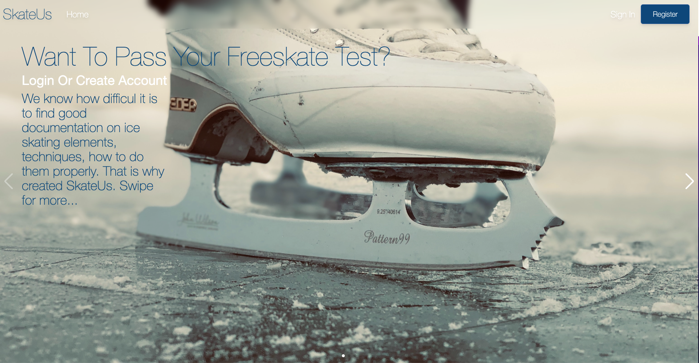

# SkateUs

## Table of Contents
- [Project Description](#project-description)
- [Installation Instructions](#installation-instructions)
- [Usage Information](#usage-information)
- [Motivation for Deployment](#motivation-for-deployment)
- [User Story](#user-story)
- [Technologies Used](#technologies-used)
- [Questions?](#questions)

## Project Description
Full stack application with authentication from JWT to provide security to users, and pages accessing MongoDB database for data storage and React front end for speed and performance.

Presentation: https://docs.google.com/presentation/d/1RrBkQMcbH3W6MedYnC-Ci7PoXcQ-FLiB-e2V-lzmISc/edit?usp=share_link

## Installation Instructions
Go to the deployed application link: https://skateus.herokuapp.com/

## Usage Information
You will be faced with the application up and running.
For you to access the learn page as well as the test submission property, you must create an account and login. You can do so by clicking on Sign In or Register buttons on the top right corner of the website. When doing so, you just need to input your information and you'll be ready to go.
To start learning all of the information we have to offer, clicl on the learn button on the navigation bar, you can also click on the test button to go to such section.

## Motivation for Deployment
Due to Covid we all had to skip forward into the future where most things are done online, sports are not a exception, that's why this application was done, to fill the need for a more convenient way to let skaters pass their rigorous tests.

## User story
As an Ice Skating student I need an application that teaches me how to pass my freekste test. Given the application I need to learn what elements I need, to pass my test. Given the elements, I need a step by step tutorial on how to perform the steps correctly, as well as video demonstrations of each element. And I need the application to let me submit a video recording of my test to be evaluated.

## Technologies Used
- Apollo server and client.
- Bcrypt.
- Concurrently.
- GraphQL.
- JsonWebToken.
- MongoDB and Mongoose.
- TailWind.
- Swiper.

## Questions?
Here is my GitHub Profile: [pargasparedes](https://github.com/pargasparedes)